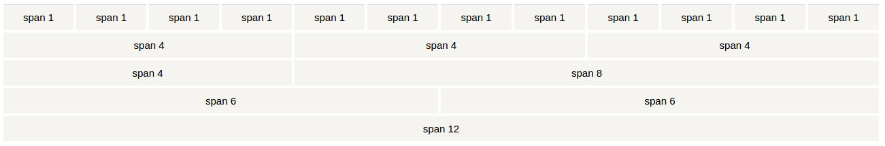

# Bootstrap

- Content from [W3schools.com](https://www.w3schools.com/bootstrap/default.asp)

## What is Bootstrap
- Bootstrap is a free front-end framework for faster and easier web
development.
- Bootstrap makes it easy to achieve responsive web design (RWD).
    - RWD is an approach to web design aimed at crafting sites to provide an optimal viewing experience, easy reading and navigation with a minimum of resizing, panning, and scrolling, across a wide range of devices

## Origins
- Bootstrap, originally named Twitter Blueprint, was developed by Mark Otto and Jacob Thornton at Twitter as a framework to encourage consistency across internal tools.

## Get Bootstrap
- Download Bootstrap from getbootstrap.com
- Include Bootstrap from a CDN

## Bootstrap Styling
### Mobile First
To ensure proper rendering and touch zooming, add the following `<meta>` tag inside the `<head>` element:

```HTML
<meta name="viewport" content="width=device-width, initial-scale=1">
```

### Containers
Bootstrap also requires a containing element to wrap site contents.

There are two container classes to choose from:

- The `.container` class provides a responsive fixed width container
- The `.container-fluid` class provides a full width container, spanning the entire width of the viewport

Note: Containers are not nestable (you cannot put a container inside another container).

```HTML
<div class="container">
  <h1>My First Bootstrap Page</h1>
  <p>This is some text.</p>
</div>
```

### Grid System
Bootstrap's grid system allows up to 12 columns across the page.

The Bootstrap grid system has four classes:

- xs (for phones)
- sm (for tablets)
- md (for desktops)
- lg (for larger desktops)



#### Basic grid
```HTML
<div class="row">
  <div class="col-*-*"></div>
</div>
<div class="row">
  <div class="col-*-*"></div>
  <div class="col-*-*"></div>
  <div class="col-*-*"></div>
</div>
<div class="row">
  ...
</div>
```

```html
<div class="col-<CLASS>-<SIZE>">.col-sm-4</div>
<div class="col-sm-4">.col-sm-4</div>
```

### Bootstrap Tables
A basic Bootstrap table has a light padding and only horizontal dividers.

```html
<table class="table">
```

- The `.table-striped` class adds zebra-stripes to a table
- The `.table-bordered` class adds borders on all sides of the table and cells
- The `.table-hover` class adds a hover effect (grey background color) on table rows:

### Bootstrap Buttons
```html
<button type="button" class="btn">Basic</button>
<button type="button" class="btn btn-default">Default</button>
<button type="button" class="btn btn-primary">Primary</button>
<button type="button" class="btn btn-success">Success</button>
<button type="button" class="btn btn-info">Info</button>
<button type="button" class="btn btn-warning">Warning</button>
<button type="button" class="btn btn-danger">Danger</button>
<button type="button" class="btn btn-link">Link</button>
```

The button classes can be used on an `<a>`, `<button>`, or `<input>` element:
```html
<a href="#" class="btn btn-info" role="button">Link Button</a>
<button type="button" class="btn btn-info">Button</button>
<input type="button" class="btn btn-info" value="Input Button">
<input type="submit" class="btn btn-info" value="Submit Button">
```

### Bootstrap Dropdown
```html
<div class="dropdown">
  <button class="btn btn-primary dropdown-toggle" type="button" data-toggle="dropdown">Dropdown Example
  <span class="caret"></span></button>
  <ul class="dropdown-menu">
    <li><a href="#">HTML</a></li>
    <li><a href="#">CSS</a></li>
    <li><a href="#">JavaScript</a></li>
  </ul>
</div>
```

- The `dropdown` class indicates a dropdown menu.
- To open the dropdown menu, use a button or a link with a class of `dropdown-toggle` and the `data-toggle=”dropdown”` attribute.
- Add the dropdown-menu class to a `<ul>` element to actually build the dropdown menu.

### Images
```html

```

- The `.img-rounded` class adds rounded corners to an image (IE8 does not support rounded corners):
- The `.img-circle` class shapes the image to a circle (IE8 does not support rounded corners):
- The `.img-thumbnail` class shapes the image to a thumbnail


- Create responsive images by adding an `.img-responsive` class to the `` tag. The image will then scale nicely to the parent element.

### Tabs and Pills
#### Tabs
```html
<ul class="nav nav-tabs">
  <li class="active"><a href="#">Home</a></li>
  <li><a href="#">Menu 1</a></li>
  <li><a href="#">Menu 2</a></li>
  <li><a href="#">Menu 3</a></li>
</ul>
```

#### Pills
```html
<ul class="nav nav-pills">
	...
```

- Pills can also be displayed vertically. Just add the `.nav-stacked` class

- Can also combine Drop Downs and Pills/Tabs:
```html
...
<li class="dropdown">
    <a class="dropdown-toggle" data-toggle="dropdown" href="#">Menu 1
    <span class="caret"></span></a>
    <ul class="dropdown-menu">
      <li><a href="#">Submenu 1-1</a></li>
      <li><a href="#">Submenu 1-2</a></li>
      <li><a href="#">Submenu 1-3</a></li>
    </ul>
</li>
...
```

### Navigation Bars
```html
<nav class="navbar navbar-default">
  <div class="container-fluid">
    <div class="navbar-header">
      <a class="navbar-brand" href="#">WebSiteName</a>
    </div>
    <ul class="nav navbar-nav">
      <li class="active"><a href="#">Home</a></li>
      <li><a href="#">Page 1</a></li>
      <li><a href="#">Page 2</a></li>
      <li><a href="#">Page 3</a></li>
    </ul>
  </div>
</nav>
```

- Align nav bar `ul` with `navbar-right`

#### Collapse

1. Add Button:
```html
<button type="button" class="navbar-toggle"
data-toggle="collapse" data-target="#myNavbar">
<span class="icon-bar"></span>
<span class="icon-bar"></span>
<span class="icon-bar"></span>
</button>
```

2. Set navbar Id:
```html
<div class="collapse navbar-collapse" id="myNavbar">
```

### Carousel
```html
<div id="myCarousel" class="carousel slide" data-ride="carousel">
  <!-- Indicators -->
  <ol class="carousel-indicators">
    <li data-target="#myCarousel" data-slide-to="0" class="active"></li>
    <li data-target="#myCarousel" data-slide-to="1"></li>
    <li data-target="#myCarousel" data-slide-to="2"></li>
    <li data-target="#myCarousel" data-slide-to="3"></li>
  </ol>

  <!-- Wrapper for slides -->
  <div class="carousel-inner" role="listbox">
    <div class="item active">
      
    </div>

    <div class="item">
      
    </div>

    <div class="item">
      
    </div>

    <div class="item">
      
    </div>
  </div>

  <!-- Left and right controls -->
  <a class="left carousel-control" href="#myCarousel" role="button" data-slide="prev">
    <span class="glyphicon glyphicon-chevron-left" aria-hidden="true"></span>
    <span class="sr-only">Previous</span>
  </a>
  <a class="right carousel-control" href="#myCarousel" role="button" data-slide="next">
    <span class="glyphicon glyphicon-chevron-right" aria-hidden="true"></span>
    <span class="sr-only">Next</span>
  </a>
</div>
```

### Modal
```html
!-- Trigger the modal with a button -->
<button type="button" class="btn btn-info btn-lg" data-toggle="modal" data-target="#myModal">Open Modal</button>

<!-- Modal -->
<div id="myModal" class="modal fade" role="dialog">
  <div class="modal-dialog">

    <!-- Modal content-->
    <div class="modal-content">
      <div class="modal-header">
        <button type="button" class="close" data-dismiss="modal">&times;</button>
        <h4 class="modal-title">Modal Header</h4>
      </div>
      <div class="modal-body">
        <p>Some text in the modal.</p>
      </div>
      <div class="modal-footer">
        <button type="button" class="btn btn-default" data-dismiss="modal">Close</button>
      </div>
    </div>

  </div>
</div>
```
